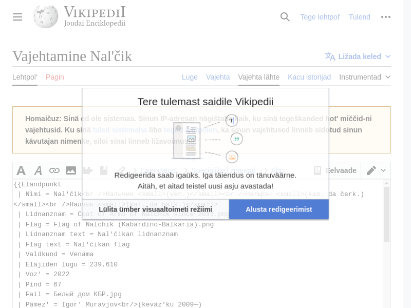

# Random Wikipedia walker

Using Selenium, create a small program that, starting from the main page https://www.wikipedia.org/, walks trough a sequence of random links and takes a snapshot of the last page.
The process is as follows:

 1. Navigate to the main page https://www.wikipedia.org/
 2. Select a random link in the page
 3. Navigate to the link
 4. Repeat steps 2 to 3 until you have visited 10 different pages
 5. Take a snapshot of the current page and save it

Include the code of the walker and the snapshot in this document.

## Answer

```py
import time
import random
from selenium import webdriver
from selenium.webdriver.common.by import By
from selenium.webdriver.common.keys import Keys
from selenium.webdriver.chrome.options import Options
from selenium.webdriver.support.ui import WebDriverWait
from selenium.webdriver.support import expected_conditions as EC

def screenshot(driver, snapshot_name):
    driver.save_screenshot(snapshot_name)
    print(f"Screenshot saved as {snapshot_name}")

def wikisnap(base_url, num_pages):
    chrome_options = Options()
    chrome_options.add_argument("--headless")

    driver = webdriver.Chrome(options=chrome_options)

    try:
        driver.get(base_url)

        for _ in range(num_pages):
            links = WebDriverWait(driver, 10).until(EC.presence_of_all_elements_located((By.TAG_NAME, 'a')))

            random_link = random.choice(links)

            link_url = random_link.get_attribute('href')

            driver.get(link_url)

            WebDriverWait(driver, 10).until(EC.presence_of_element_located((By.TAG_NAME, 'body')))

        snapshot_name = "last_page_screenshot.png"
        screenshot(driver, snapshot_name)

    except Exception as e:
        print(f"Error: {e}")

    finally:
        driver.quit()

if __name__ == "__main__":
    base_url = "https://www.wikipedia.org/"
    num_pages = 10

    wikisnap(base_url, num_pages)
```

Snapshot:


